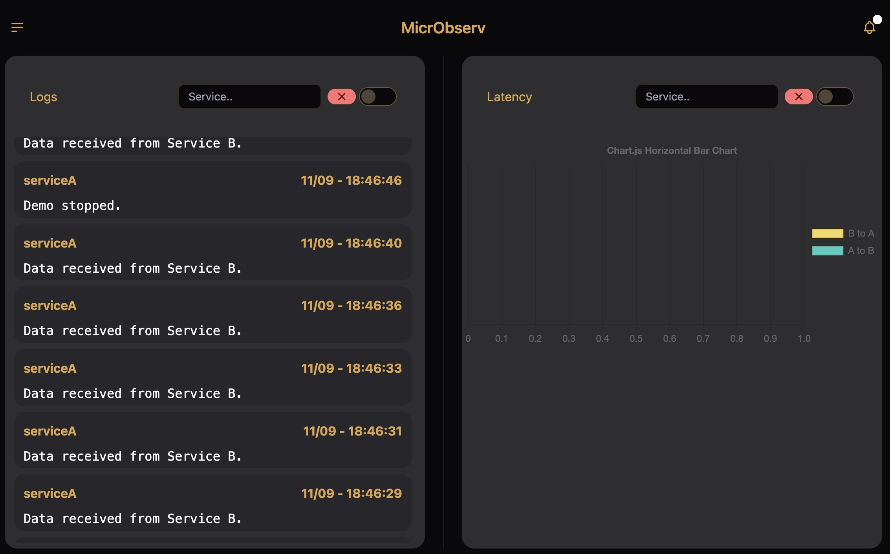

[![Contributors][contributors-shield]][contributors-url]
[![Forks][forks-shield]][forks-url]
[![Stargazers][stars-shield]][stars-url]
[![Issues][issues-shield]][issues-url]
[![MIT License][license-shield]][license-url]
[![LinkedIn][linkedin-shield]][linkedin-url]

<!-- PROJECT LOGO -->
<br />
<div align="center">
  <a href="https://github.com/oslabs-beta/MicrObserv/">
    
  </a>

  <h3 align="center">MicrObserv</h3>

  <p align="center">
    A real-time & event driven observability tool for microservices!
    <br />
    <a href="https://github.com/oslabs-beta/MicrObserv/blob/dev/README.md"><strong>Explore the docs »</strong></a>
    <br />
    <br />
    <a href="https://github.com/oslabs-beta/MicrObserv/issues">Report Bug</a>
    ·
    <a href="https://github.com/oslabs-beta/MicrObserv/issues">Request Feature</a>
  </p>
</div>

<!-- TABLE OF CONTENTS -->
<details>
  <summary>Table of Contents</summary>
  <ol>
    <li>
      <a href="#about-the-project">About The Project</a>
      <ul>
        <li><a href="#built-with">Built With</a></li>
      </ul>
    </li>
    <li>
      <a href="#getting-started">Getting Started</a>
    </li>
    <li><a href="#usage">Usage</a></li>
    <li><a href="#roadmap">Roadmap</a></li>
    <li><a href="#contributing">Contributing</a></li>
    <li><a href="#license">License</a></li>
    <li><a href="#contact">Contact</a></li>
    <li><a href="#acknowledgments">Acknowledgments</a></li>
  </ol>
</details>

<!-- ABOUT THE PROJECT -->

## About The Project

MicrObserv is here to simplify observability for your microservice architecture by consolidating all logs and tracers into one centralized database.

<!-- GETTING STARTED -->

## Getting Started

1. Fork and Clone the repo

2. Install dependencies
    ```sh
    cd Backend
    ```
    ```sh
    npm install
    ```

2. Demo the application (skip to step 3 if you want to implement on your actual microservices)
    1. Install dependencies
        ```sh
        cd ../Demo
        ```
        ```sh
        npm run install
        ```
    2. Create .env file in the Demo folder
        1. Assign a PostgreSQL URI to "DEMO_URI"
    3. Start servers
        ```sh
        cd ../Backend
        ```
        1. Start Backend Server
        ```sh
        npm start
        ```
        2. Start demo backend server
        ```sh
        cd ../Demo
        ```
        ```sh
        npm run start-services
        ```
    4. Launch demo front-end 
        ```sh
        npm run start-web-app
        ```
        1. This will open the frontend in your Chrome browser to start up the demo microservices, which includes 2 services communicating back and forth
            - includes two input fields
              - Request Time - simulates the speed at which a microservice will take to respond to a request
              - Time Out - refers to how often the a new request will be made
                - this should be greater than Request Time


3. Microservice Integration 
    1. Install npm package in each microservice for tracking data.
    ```sh
    npm i microbserv
    ```
    2. Locally start microbserv server
      1. clone Microbserv repo
      2. Inside repo change directories and enter Backend folder
      ```sh
      cd Backend
      ```
      3. Install npm dependencies
      ```sh
      npm install
      ```
      4. Start server
      ```sh
      npm start
      ```
    
4. Download and Launch MicrObserv executable based on your OS
   - This is a link to our DropBox 
   https://www.dropbox.com/s/n8s2wzp8ucgs9cx/MicrOberv-1.0.0-arm64.dmg?dl=0
   - Launching takes you to the homepage where you can input your system name and a valid PostgreSQL URI for storing logs and tracers.
5. Click on your newly added system
<div align="center">

</div>

<div align="center">
<a href="https://github.com/oslabs-beta/MicrObserv/">

</a>
</div>

<p align="right">(<a href="#readme-top">back to top</a>)</p>

### Built With

- [![React][react.js]][react-url]
- [![Electron][electron.com]][electron-url]
- [![Node.js][node.com]][node-url]
- [![Express.js][express.com]][express-url]
- [![Webpack][webpack.com]][webpack-url]
- [![Websocket][websocket.com]][websocket-url]
- [![Typescript][typescript.com]][typescript-url]
- [![Chart.js][chartjs.com]][chartjs-url]
- [![PostgresSQL][postgres.dev]][postgres-url]
- [![Tailwindcss][tailwindcss.com]][tailwindcss-url]

<p align="right">(<a href="#readme-top">back to top</a>)</p>

<!-- ROADMAP -->

## Roadmap

- [x] Add README
- [ ] Add GitHub Merge Tracking.
- [ ] Add Login & Registration.
- [ ] Add Multiple Charts to keep track of different metrics.

See the [open issues](https://github.com/oslabs-beta/MicrObserv/issues?q=is%3Aopen+is%3Aissue) for a full list of proposed features (and known issues).

<p align="right">(<a href="#readme-top">back to top</a>)</p>

<!-- CONTRIBUTING -->

## Contributing

Contributions are what make the open source community such an amazing place to learn, inspire, and create. Any contributions you make are **greatly appreciated**.

If you have a suggestion that would make this better, please fork the repo and create a pull request. You can also simply open an issue with the tag "enhancement".
Don't forget to give the project a star! Thanks again!

1. Fork the Project
2. Create your Feature Branch (`git checkout -b feature/AmazingFeature`)
3. Commit your Changes (`git commit -m 'Add some AmazingFeature'`)
4. Push to the Branch (`git push origin feature/AmazingFeature`)
5. Open a Pull Request

<p align="right">(<a href="#readme-top">back to top</a>)</p>

<!-- LICENSE -->

## License

Distributed under the MIT License. See `LICENSE.txt` for more information.

<p align="right">(<a href="#readme-top">back to top</a>)</p>

<!-- CONTACT -->

## Contact

- Andrew Ngo - [@andrew-tien-ngo](https://www.linkedin.com/in/andrew-tien-ngo/) - andrewngo91@gmail.com
- Chancellor Kupersmith - [@chance-kupersmith](https://www.linkedin.com/in/chance-kupersmith/) - kupersmith3.6@gmail.com
- Otis Jones - [@otis-jones](https://www.linkedin.com/in/andrew-tien-ngo/) - otisjones1@gmail.com
- Vardan Vanyan - [@vardanvanyan](https://www.linkedin.com/in/vardanvanyan/) - vardan.vanyan@gmail.com

- Project Link: [https://github.com/oslabs-beta/MicrObserv](https://github.com/oslabs-beta/MicrObserv)

<p align="right">(<a href="#readme-top">back to top</a>)</p>

<!-- ACKNOWLEDGMENTS -->

## Acknowledgments

- [OSlabs](https://opensourcelabs.io/)
- [Electron Docs](https://www.electronjs.org/docs/latest)
- [React Docs](https://reactjs.org/docs/getting-started.html)
- [Webpack Docs](https://webpack.js.org/concepts/)
- [Tailwindcss Docs](https://tailwindcss.com/docs/installation)
- [Daisy UI](https://daisyui.com/docs/install/)
- [Express Docs](https://expressjs.com/en/guide/routing.html)
- [PostgresSQL](https://www.postgresql.org/docs/)

<p align="right">(<a href="#readme-top">back to top</a>)</p>

<!-- MARKDOWN LINKS & IMAGES -->
<!-- https://www.markdownguide.org/basic-syntax/#reference-style-links -->

[contributors-shield]: https://img.shields.io/github/contributors/othneildrew/Best-README-Template.svg?style=for-the-badge
[contributors-url]: https://github.com/oslabs-beta/MicrObserv/graphs/contributors
[forks-shield]: https://img.shields.io/github/forks/oslabs-beta/MicrObserv?style=for-the-badge
[forks-url]: https://github.com/oslabs-beta/MicrObserv/network/members
[stars-shield]: https://img.shields.io/github/stars/oslabs-beta/MicrObserv?style=for-the-badge
[stars-url]: https://github.com/oslabs-beta/MicrObserv/stargazers
[issues-shield]: https://img.shields.io/github/issues/oslabs-beta/MicrObserv?style=for-the-badge
[issues-url]: https://github.com/oslabs-beta/MicrObserv/issues
[license-shield]: https://img.shields.io/github/license/oslabs-beta/MicrObserv?style=for-the-badge
[license-url]: https://github.com/oslabs-beta/MicrObserv/blob/master/LICENSE.txt
[linkedin-shield]: https://img.shields.io/badge/-LinkedIn-black.svg?style=for-the-badge&logo=linkedin&colorB=555
[linkedin-url]: https://www.linkedin.com/company/microbserv/
[product-screenshot]: images/screenshot.png
[react.js]: https://img.shields.io/badge/React-20232A?style=for-the-badge&logo=react&logoColor=61DAFB
[react-url]: https://reactjs.org/
[postgres.dev]: https://img.shields.io/badge/PostgreSQL-316192?style=for-the-badge&logo=postgresql&logoColor=white
[postgres-url]: https://www.postgresql.org/
[electron.com]: https://img.shields.io/badge/Electron-191970?style=for-the-badge&logo=Electron&logoColor=white
[electron-url]: https://www.electronjs.org/
[tailwindcss.com]: https://img.shields.io/badge/Tailwind_CSS-38B2AC?style=for-the-badge&logo=tailwind-css&logoColor=white
[tailwindcss-url]: https://tailwindcss.com/
[node.com]: https://img.shields.io/badge/Node.js-43853D?style=for-the-badge&logo=node.js&logoColor=white
[node-url]: https://nodejs.org/en/
[express.com]: https://img.shields.io/badge/Express.js-404D59?style=for-the-badge
[express-url]: https://expressjs.com/
[typescript.com]: https://img.shields.io/badge/TypeScript-007ACC?style=for-the-badge&logo=typescript&logoColor=white
[typescript-url]: https://www.typescriptlang.org/
[chartjs.com]: https://img.shields.io/badge/chart.js-F5788D.svg?style=for-the-badge&logo=chart.js&logoColor=white
[chartjs-url]: https://www.chartjs.org/
[webpack.com]: https://img.shields.io/badge/webpack-%238DD6F9.svg?style=for-the-badge&logo=webpack&logoColor=black
[webpack-url]: https://webpack.js.org/
[websocket.com]: https://img.shields.io/badge/WS-Websocket-2ea44f?style=for-the-badge&logo=appveyor
[websocket-url]: https://webpack.js.org/
