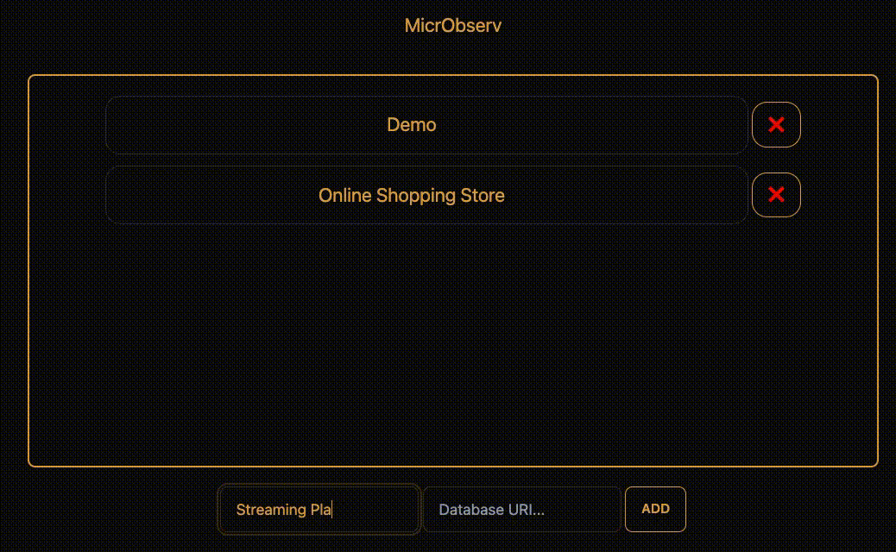

[![Contributors][contributors-shield]][contributors-url]
[![Forks][forks-shield]][forks-url]
[![Stargazers][stars-shield]][stars-url]
[![Issues][issues-shield]][issues-url]
[![MIT License][license-shield]][license-url]
[![LinkedIn][linkedin-shield]][linkedin-url]

<!-- PROJECT LOGO -->
<br />
<div align="center">
  <a href="https://github.com/oslabs-beta/MicrObserv/">
    
  </a>

  <h3 align="center">MicrObserv</h3>

  <p align="center">
    A real-time & event driven observability tool for microservices!
    <br />
    <a href="https://github.com/oslabs-beta/MicrObserv/blob/dev/README.md"><strong>Explore the docs »</strong></a>
    <br />
    <br />
    <a href="https://github.com/oslabs-beta/MicrObserv/issues">Report Bug</a>
    ·
    <a href="https://github.com/oslabs-beta/MicrObserv/issues">Request Feature</a>
  </p>
</div>

<!-- TABLE OF CONTENTS -->
<details>
  <summary>Table of Contents</summary>
  <ol>
    <li>
      <a href="#about-the-project">About The Project</a>
      <ul>
        <li><a href="#built-with">Built With</a></li>
      </ul>
    </li>
    <li>
      <a href="#getting-started">Getting Started</a>
      <ul>
        <li><a href="#prerequisites">Prerequisites</a></li>
        <li><a href="#installation">Installation</a></li>
      </ul>
    </li>
    <li><a href="#usage">Usage</a></li>
    <li><a href="#roadmap">Roadmap</a></li>
    <li><a href="#contributing">Contributing</a></li>
    <li><a href="#license">License</a></li>
    <li><a href="#contact">Contact</a></li>
    <li><a href="#acknowledgments">Acknowledgments</a></li>
  </ol>
</details>

<!-- ABOUT THE PROJECT -->

## About The Project

<div align="center" >
<a href="https://github.com/oslabs-beta/MicrObserv/">

</a>
</div>
<div align="center">
<a href="https://github.com/oslabs-beta/MicrObserv/">

</a>
</div>

There are many great README templates available on GitHub; however, I didn't find one that really suited my needs so I created this enhanced one. I want to create a README template so amazing that it'll be the last one you ever need -- I think this is it.

Here's why:

- Your time should be focused on creating something amazing. A project that solves a problem and helps others
- You shouldn't be doing the same tasks over and over like creating a README from scratch
- You should implement DRY principles to the rest of your life :smile:

Of course, no one template will serve all projects since your needs may be different. So I'll be adding more in the near future. You may also suggest changes by forking this repo and creating a pull request or opening an issue. Thanks to all the people have contributed to expanding this template!

Use the `BLANK_README.md` to get started.

<p align="right">(<a href="#readme-top">back to top</a>)</p>

<!-- DEMO -->

## Demo

<div align="center">

</div>

<p align="right">(<a href="#readme-top">back to top</a>)</p>

### Built With

- [![React][react.js]][react-url]
- [![Electron][electron.com]][electron-url]
- [![Node.js][node.com]][node-url]
- [![Express.js][express.com]][express-url]
- [![Webpack][webpack.com]][webpack-url]
- [![Typescript][typescript.com]][typescript-url]
- [![Typescript][typescript.com]][typescript-url]
- [![PostgresSQL][postgres.dev]][postgres-url]
- [![Tailwindcss][tailwindcss.com]][tailwindcss-url]
- Websockets

<p align="right">(<a href="#readme-top">back to top</a>)</p>

<!-- GETTING STARTED -->

## Getting Started

This is an example of how you may give instructions on setting up your project locally.
To get a local copy up and running follow these simple example steps.

### Prerequisites

Make sure you are running version v18.10.0 of node.

- npm
  ```sh
  npm install npm@latest -g
  ```

### Installation

1. Clone the repo
   ```sh
   git clone https://github.com/oslabs-beta/MicrObserv.git
   ```
2. Install NPM packages
   ```sh
   npm install
   ```

<p align="right">(<a href="#readme-top">back to top</a>)</p>

<!-- USAGE EXAMPLES -->

## Usage

Use this space to show useful examples of how a project can be used. Additional screenshots, code examples and demos work well in this space. You may also link to more resources.

_For more examples, please refer to the [Documentation](https://example.com)_

<p align="right">(<a href="#readme-top">back to top</a>)</p>

<!-- ROADMAP -->

## Roadmap

- [x] Add README
- [x] Add back to top links
- [ ] Add Additional Templates w/ Examples
- [ ] Add Additional Templates w/ Examples
- [ ] Add Additional Templates w/ Examples

See the [open issues](https://github.com/oslabs-beta/MicrObserv/issues?q=is%3Aopen+is%3Aissue) for a full list of proposed features (and known issues).

<p align="right">(<a href="#readme-top">back to top</a>)</p>

<!-- CONTRIBUTING -->

## Contributing

Contributions are what make the open source community such an amazing place to learn, inspire, and create. Any contributions you make are **greatly appreciated**.

If you have a suggestion that would make this better, please fork the repo and create a pull request. You can also simply open an issue with the tag "enhancement".
Don't forget to give the project a star! Thanks again!

1. Fork the Project
2. Create your Feature Branch (`git checkout -b feature/AmazingFeature`)
3. Commit your Changes (`git commit -m 'Add some AmazingFeature'`)
4. Push to the Branch (`git push origin feature/AmazingFeature`)
5. Open a Pull Request

<p align="right">(<a href="#readme-top">back to top</a>)</p>

<!-- LICENSE -->

## License

Distributed under the MIT License. See `LICENSE.txt` for more information.

<p align="right">(<a href="#readme-top">back to top</a>)</p>

<!-- CONTACT -->

## Contact

- Andrew Ngo - [@andrew-tien-ngo](https://www.linkedin.com/in/andrew-tien-ngo/) - andrewngo91@gmail.com
- Chancellor Kupersmith - [@chance-kupersmith](https://www.linkedin.com/in/chance-kupersmith/) - kupersmith3.6@gmail.com
- Otis Jones - [@otis-jones](https://www.linkedin.com/in/andrew-tien-ngo/) - email@example.com
- Vardan Vanyan - [@vardanvanyan](https://www.linkedin.com/in/vardanvanyan/) - vardan.vanyan@gmail.com

- Project Link: [https://github.com/oslabs-beta/MicrObserv](https://github.com/oslabs-beta/MicrObserv)

<p align="right">(<a href="#readme-top">back to top</a>)</p>

<!-- ACKNOWLEDGMENTS -->

## Acknowledgments

Use this space to list resources you find helpful and would like to give credit to. I've included a few of my favorites to kick things off!

- [Choose an Open Source License](https://choosealicense.com)
- [GitHub Emoji Cheat Sheet](https://www.webpagefx.com/tools/emoji-cheat-sheet)
- [Malven's Flexbox Cheatsheet](https://flexbox.malven.co/)
- [Malven's Grid Cheatsheet](https://grid.malven.co/)
- [Img Shields](https://shields.io)
- [GitHub Pages](https://pages.github.com)
- [Font Awesome](https://fontawesome.com)
- [React Icons](https://react-icons.github.io/react-icons/search)

<p align="right">(<a href="#readme-top">back to top</a>)</p>

<!-- MARKDOWN LINKS & IMAGES -->
<!-- https://www.markdownguide.org/basic-syntax/#reference-style-links -->

[contributors-shield]: https://img.shields.io/github/contributors/othneildrew/Best-README-Template.svg?style=for-the-badge
[contributors-url]: https://github.com/oslabs-beta/MicrObserv/graphs/contributors
[forks-shield]: https://img.shields.io/github/forks/oslabs-beta/MicrObserv?style=for-the-badge
[forks-url]: https://github.com/oslabs-beta/MicrObserv/network/members
[stars-shield]: https://img.shields.io/github/stars/oslabs-beta/MicrObserv?style=for-the-badge
[stars-url]: https://github.com/oslabs-beta/MicrObserv/stargazers
[issues-shield]: https://img.shields.io/github/issues/oslabs-beta/MicrObserv?style=for-the-badge
[issues-url]: https://github.com/oslabs-beta/MicrObserv/issues
[license-shield]: https://img.shields.io/github/license/oslabs-beta/MicrObserv?style=for-the-badge
[license-url]: https://github.com/oslabs-beta/MicrObserv/blob/master/LICENSE.txt
[linkedin-shield]: https://img.shields.io/badge/-LinkedIn-black.svg?style=for-the-badge&logo=linkedin&colorB=555
[linkedin-url]: https://www.linkedin.com/company/microbserv/
[product-screenshot]: images/screenshot.png
[react.js]: https://img.shields.io/badge/React-20232A?style=for-the-badge&logo=react&logoColor=61DAFB
[react-url]: https://reactjs.org/
[postgres.dev]: https://img.shields.io/badge/PostgreSQL-316192?style=for-the-badge&logo=postgresql&logoColor=white
[postgres-url]: https://www.postgresql.org/
[electron.com]: https://img.shields.io/badge/Electron-191970?style=for-the-badge&logo=Electron&logoColor=white)
[electron-url]: https://www.electronjs.org/
[tailwindcss.com]: https://img.shields.io/badge/Tailwind_CSS-38B2AC?style=for-the-badge&logo=tailwind-css&logoColor=white
[tailwindcss-url]: https://tailwindcss.com/
[node.com]: https://img.shields.io/badge/Node.js-43853D?style=for-the-badge&logo=node.js&logoColor=white
[node-url]: https://nodejs.org/en/
[express.com]: https://img.shields.io/badge/Express.js-404D59?style=for-the-badge
[express-url]: https://expressjs.com/
[typescript.com]: https://img.shields.io/badge/TypeScript-007ACC?style=for-the-badge&logo=typescript&logoColor=white
[typescript-url]: https://www.typescriptlang.org/
[chartjs.com]: https://img.shields.io/badge/chart.js-F5788D.svg?style=for-the-badge&logo=chart.js&logoColor=white
[chartjs-url]: https://www.chartjs.org/
[webpack.com]: https://img.shields.io/badge/webpack-%238DD6F9.svg?style=for-the-badge&logo=webpack&logoColor=black
[webpack-url]: https://webpack.js.org/
